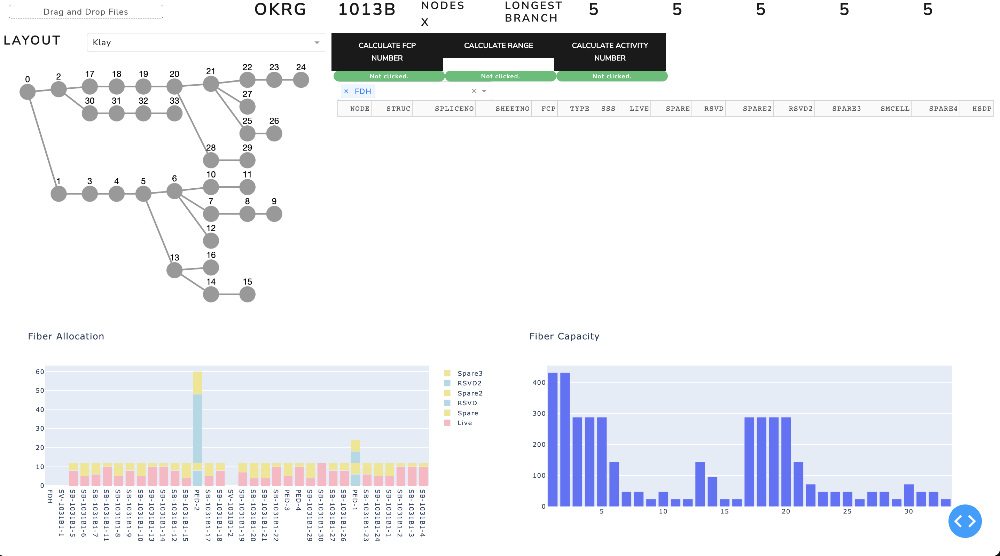

This is a web application to aid Fibre Optic Network Design for Telecommunications Networks.

## Installation and Setup

### Clone this repository
`git clone https://github.com/patchworquill/afl-dash`

### Create a new python environment with
`python3.9 -m venv afl-dash`

Activate it
`source afl-dash/bin/activate`

### Install requirements
`pip install -r requirements.txt`

### Run the application
`python application.py`

Go to [localhost](http://127.0.0.1:8050) in

